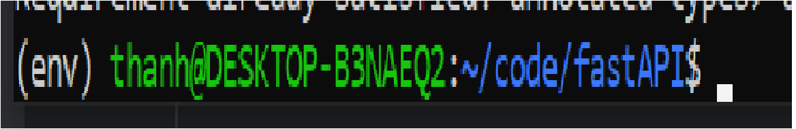

# FastAPI Documentation

## Create Virtual Environment
Creaing Virtual Environment to install unique packages for every single project in order to avoid conflict among projects to each other. \
Link : https://www.digitalocean.com/community/tutorials/how-to-install-python-3-and-set-up-a-programming-environment-on-ubuntu-20-04-quickstart \
Create virtual environment : python3 -m venv "folder_name" (env) \
Active virtual environment : source env/bin/activate (Linux) || source env/Scripts/activate (Windows). \
 \
The "env" part at the start of the line means virtual environment has been activated. \

## Install Some important dependencies.
pip3 install fastapi \
pip3 install pydantic \
pip3 install sqlalchemy


# Basic fastAPI

## Route
```python
from fastapi import FastAPI
#create an instance
app = FastAPI()
#get the base url 
#("/") called path
@app.get("/")
def hello():
    return "Hello World"
# if you want to return a json data 
  # return {"data" : {"name" : "thanh"}}
```
## Method
@app is called path operation decorator.
We got 4 four methods : GET , POST , PUT , DELETE.\
GET is a method to retrieve data from the server. \
POST is a method to send data to the server. \
PUT is a method to update resources that already exists in the server.\
DELETE is a method to delete resources in the server.


The function below operation decorator is called path operation function.
## Parameters
```python
@app.get("/blog/{id}")
def about(id : int):
    return {"data": id}
```
'id' is the parameter transfer into function

## The advantage of fastAPI
FastAPI doesn't require users to use a SQL database. \
But you still can use any relational database you want.\
FastAPI works with any database and any style of library to talk to the database.
### ORM
With ORM (object-relational mapping), we can convert ("map") between objects in code to database table.\
Each instance object of that class represents a row in database.\ 
With the help of pydantic library we can create a class representing a row in database easily.
```python
#schemas.py
from pydantic import BaseModel

class Blog(BaseModel):
    title: str
    body: str

#model.py  
from sqlalchemy import Boolean, Column, ForeignKey, Integer, String
from database import Base

class Blog(Base):
    __tablename__ = 'blog'
    ID = Column(Integer, primary_key=True, index=True)
    title = Column(String)
    body = Column(String)
    
#databse.py
from sqlalchemy import create_engine
from sqlalchemy.ext.declarative import declarative_base
from sqlalchemy.orm import sessionmaker

SQLALCHEMY_DATABASE_URL = 'sqlite:///./blog.db'
engine = create_engine(SQLALCHEMY_DATABASE_URL, connect_args={"check_same_thread": False})
SessionLocal = sessionmaker(autocommit=False, autoflush=False, bind=engine)
Base = declarative_base()
```
Use sqlalchemy library to define the type of data of a class, create a database and connect to it. 


